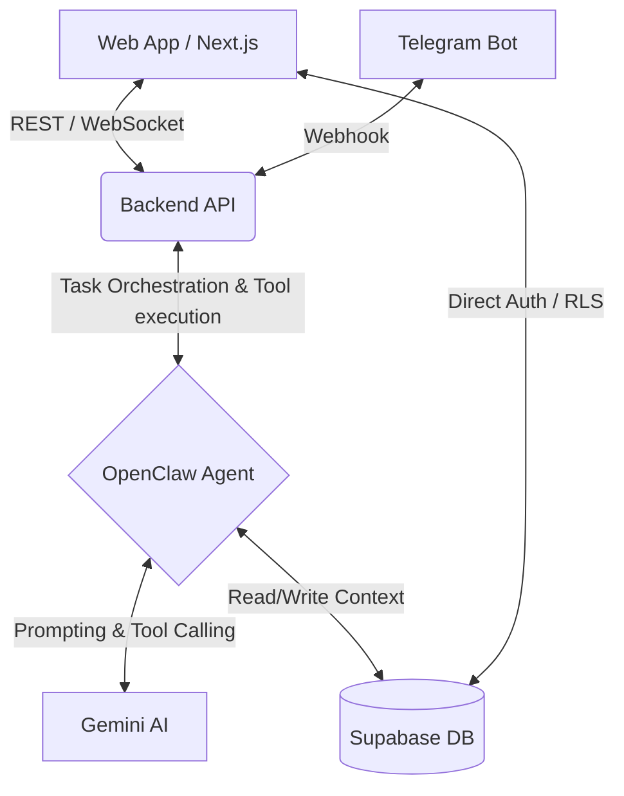

# Fitness Coach AI Agent - Implementation Plan

## 1. System Architecture Overview

The system follows a modern, decoupled architecture allowing for rapid feature iteration and robust scalability.

- **Frontend (Web/Mobile)**: Next.js (React) or React Native, serving as the user interface. It communicates via REST or GraphQL to the backend.
- **Backend (API + Agent Layer)**: Node.js (TypeScript) or Python FastAPI. This layer hosts the OpenClaw orchestration logic.
- **Database & Authentication**: Supabase (Postgres). It handles user identity, Row Level Security (RLS) for privacy, and persistent storage of all application data.
- **LLM Engine**: Gemini AI (via Google Cloud or API). Acts as the brain, processing natural language, reasoning, and calling tools.
- **Bot Integration (Optional/Bonus)**: A Telegram Bot webhook integrated into the backend API to duplicate the frontend experience contextually.



## 2. Agent Design (Tools, Memory, Planning)

**Core Persona:** An empathetic, knowledgeable, and strict-when-necessary elite fitness coach.

**Memory Strategy:**
- **Short-term Memory (Working Context):** The last N conversation turns managed directly in the running session to maintain conversational fluency.
- **Long-term Memory (Semantic/Structured):** The user's profile, logged workouts, and explicit preferences are saved into structured Supabase tables. Before each agent interaction, OpenClaw fetches these details and injects them into the system prompt.

**Key Tools (Functions provided to Gemini):**
1. `UpdateUserProfile(age, weight, goals, injuries, experience)`: Updates the DB dynamically as the user mentions new information.
2. `GenerateWorkoutPlan(parameters)`: Triggers a separate deterministic or specialized LLM sub-agent step to create a structured JSON plan and saves it to DB.
3. `LogWorkout(exercises_completed, duration)`: Logs a daily session to Supabase.
4. `GetHistoricalProgress(metric)`: Retrieves historical data (e.g., past 4 weigh-ins) so the agent can reference it.

**Planning Strategy:**
The agent uses a **ReAct** (Reason+Act) or **Plan-and-Solve** approach. When a user asks "What should I do today?", the agent *thinks*: "I need to check their active plan and what they did yesterday" -> *Acts* (Calls `GetHistoricalProgress`) -> *Observes* (User did Back yesterday) -> *Responds* (Propose Leg day today).

## 3. Supabase Database Schema

```sql
-- 1. Users 
CREATE TABLE users (
  id UUID PRIMARY KEY REFERENCES auth.users,
  name TEXT,
  age INT,
  weight_kg DECIMAL,
  height_cm DECIMAL,
  fitness_goals TEXT[],
  experience_level TEXT,       -- 'beginner', 'intermediate', 'advanced'
  health_conditions TEXT[],
  created_at TIMESTAMP DEFAULT NOW()
);

-- 2. Workout Plans
CREATE TABLE workout_plans (
  id UUID PRIMARY KEY DEFAULT uuid_generate_v4(),
  user_id UUID REFERENCES users(id),
  plan_name TEXT,
  target_goal TEXT,
  is_active BOOLEAN DEFAULT true,
  plan_json JSONB,             -- Structured routine (days, sets, reps)
  created_at TIMESTAMP DEFAULT NOW()
);

-- 3. Daily Workout Logs
CREATE TABLE workout_logs (
  id UUID PRIMARY KEY DEFAULT uuid_generate_v4(),
  user_id UUID REFERENCES users(id),
  workout_date DATE DEFAULT CURRENT_DATE,
  exercises_completed JSONB,   -- Array of { "name", "sets", "reps", "weight" }
  duration_minutes INT,
  calories_burned INT,
  agent_notes TEXT,
  created_at TIMESTAMP DEFAULT NOW()
);

-- 4. Chat History
CREATE TABLE chat_logs (
  id UUID PRIMARY KEY DEFAULT uuid_generate_v4(),
  user_id UUID REFERENCES users(id),
  message TEXT,
  role TEXT,                   -- 'user', 'agent', 'system'
  created_at TIMESTAMP DEFAULT NOW()
);
```

## 4. API Design

RESTful endpoints connecting the Client, Backend, and Agents:

- **Auth:** Handled via Supabase Client (Magic Links or OAuth).
- **`POST /api/chat`:** 
  - *Payload:* `{ user_id, message }`
  - *Action:* Hands the message to OpenClaw. Returns the agent's response (optionally streamed via Server-Sent Events).
- **`GET /api/user/{id}/profile`:** Fetch onboarding data.
- **`GET /api/user/{id}/plans/active`:** Fetch the active JSON plan to render nicely in the UI.
- **`POST /api/telegram/webhook`:** Dedicated endpoint to receive Telegram messages, map the Telegram ID to a Supabase user ID, and pipe the message into OpenClaw.

## 5. Agent Workflow (Step-by-Step Interaction Flow)

1. **Intake / Onboarding:** 
   - User signs up. The agent detects an empty profile. 
   - *Agent:* "Welcome! To build your perfect plan, what's your primary goal: building muscle, losing weight, or general fitness?" 
   - *Flow:* Agent asks sequentially, eventually calling `UpdateUserProfile`.
2. **Plan Generation:** 
   - Once intake is complete, agent uses Gemini to synthesize the data and calls `GenerateWorkoutPlan`. 
   - *Agent:* "I've created a 4-day split for you. We start with Upper Body tomorrow!"
3. **Daily Engagement:** 
   - *User:* "I'm at the gym, what's first?" 
   - *Agent:* Looks up active plan for today -> "Start with Barbell Bench Press, 3 sets of 10. Let me know when you're done or if you need form tips."
4. **Logging:** 
   - *User:* "Done, but I could only do 8 reps on the last set." 
   - *Agent:* Calls `LogWorkout` -> "Logged! Great effort. Next time we might adjust the weight slightly. Next up: Incline Dumbbell Press."
5. **Periodic Review:** 
   - Weekly, the agent evaluates `workout_logs` and suggests adjusting calories or weight in the plan.

## 6. Prompt Design for Gemini

**System Prompt Example:**
```text
You are an elite, motivational, and highly knowledgeable Fitness Coach AI named "Titan".
Your goal is to help your client achieve their fitness goals safely and consistently.

--- CURRENT CLIENT CONTEXT ---
Name: {user.name}
Goal: {user.fitness_goals}
Experience: {user.experience_level}
Recent Injuries: {user.health_conditions}
Active Plan: {active_plan_summary}
------------------------------

Instructions:
1. Always be encouraging but hold the user accountable.
2. If the user asks for their daily routine, reference the 'Active Plan'.
3. If the user reports finishing a workout or exercise, use the 'LogWorkout' tool to save it.
4. Do not provide medical advice. If an injury is mentioned, advise them to see a doctor and offer to adjust the plan.
5. Keep your responses concise and formatted cleanly with markdown.
```

## 7. How OpenClaw Will Orchestrate Tasks

OpenClaw will operate as the **Router and Executor**:
1. It receives the raw text from `/api/chat`.
2. It fetches the Supabase context via predefined setup hooks, constructing the ultimate prompt.
3. It passes the prompt to Gemini.
4. If Gemini replies with "I want to use tool `LogWorkout({"weight": 100})`", OpenClaw pauses, executes the actual database logic (`INSERT INTO workout_logs...`), takes the success result, and passes it back to Gemini.
5. Gemini generates a natural language reply like "Excellent, I've noted that down!"
6. OpenClaw returns this final string back down the pipeline to the user interface.

## 8. Data Flow Lifecycle

1. **User Input:** `User` -> `Next.js App` 
2. **API Request:** `Next.js App` -> `POST /api/chat` (Backend)
3. **Context Assembly:** `Backend` queries `Supabase` (Context fetch)
4. **Orchestration:** `OpenClaw` formats prompt + context -> `Gemini`
5. **Reasoning:** `Gemini` decides to use a Tool -> `OpenClaw` executes it against `Supabase`.
6. **Final Synthesis:** Tool output -> `Gemini` -> `OpenClaw`.
7. **Delivery:** `OpenClaw` -> `Backend` -> `Next.js App` -> `User`.

## 9. MVP Features vs Future Features

| **MVP Features** | **Future Horizons (v2, v3)** |
| --- | --- |
| Chat-based text onboarding | Image analysis (snap a photo of meals for calorie tracking) |
| Standard Workout generation & text logging | Wearable integrations (Apple Health / Whoop / Oura API) |
| Diet suggestion generation | Video form-check (upload deadlift video -> get posture feedback) |
| Supabase Auth & DB setup | Push notifications & habit tracking reminders |
| Responsive Web UI & Telegram Bot | Voice Mode Coaching (Real-time voice agent during the workout) |

## 10. Suggested Folder / Project Structure

```text
/fitness-agent-project
├── /frontend-web             # Next.js Application
│   ├── /components           # Chat UI, Plan display, Login
│   ├── /app                  # Pages, Routing
│   └── /lib/supabase         # Supabase Client JS
├── /backend-agent            # Python (FastAPI) or Node (Express)
│   ├── /openclaw_engine      # Agent Setup
│   │   ├── tools.py          # Functions for Gemini
│   │   ├── prompts.py        # System prompts & templates
│   │   └── agent.py          # OpenClaw initialization
│   ├── /api                  # API Endpoints (Chat, Webhooks)
│   └── /services             # Supabase Database Wrappers
└── /database                 # Supabase Migrations & Schema.sql
```

## 11. Key Technical Challenges and Solutions

1. **Challenge:** *Hallucinated or dangerous exercises/diet plans.*
   - **Solution:** Restrict Gemini's creative liberty for plan generation by enforcing structured JSON output validated against predefined, safe exercise databases. Use a strict temperature (e.g., 0.2) for the planning agent.
2. **Challenge:** *Context Window limit overflow over long user lifespans.*
   - **Solution:** Implement semantic summarization. Every 50 messages, trigger a background agent task to summarize the chat log and append it to an "evergreen user notes" column in Supabase, dropping old raw logs from the prompt.
3. **Challenge:** *Conversational State across Platforms (Web vs Telegram).*
   - **Solution:** Use Supabase to perfectly synchronize state via a unified `session_id` or `user_id`. Regardless of whether a user chats on Telegram or the Web App, OpenClaw fetches the latest uniform state.
